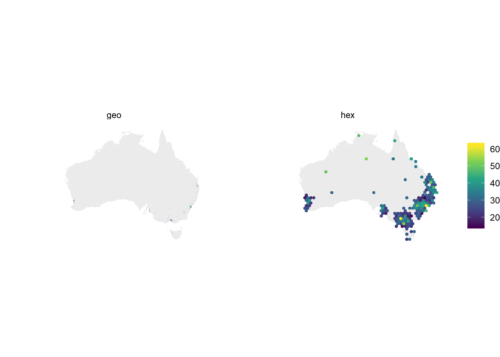
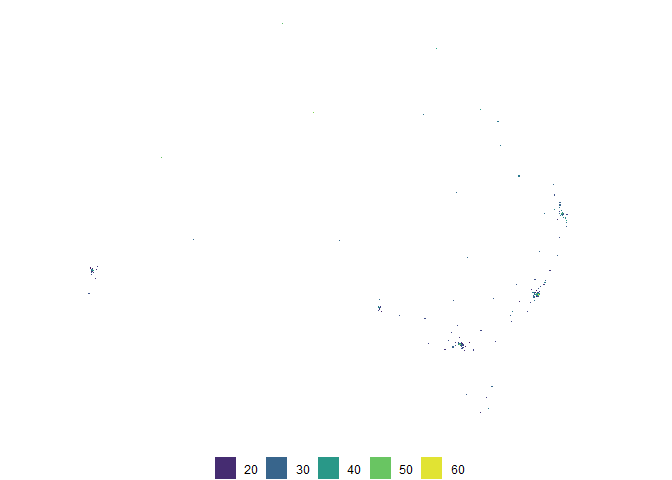

<!-- README.md is generated from this README.Rmd. Please edit this file -->

# sugarbag 

[](https://travis-ci.org/srkobakian/sugarbag)

The **sugarbag** package creates tesselated hexagon maps for visualising
geo-spatial data. Hexagons of equal size are positioned to best preserve
relationships to focal points, and minimise distance from their actual
location. This method provides an alternative to cartograms that allows
all regions to be compared on the same visual scale.

Maps containing regions with a few small and densely populated areas are
extremely distorted in cartograms. An example of this is a population
cartogram of Australia, which distorts the map into an unrecognisable
shape. The technique implemented in this package is particularly useful
for these
regions.

## Installation

<!-- You can install the released version of sugarbag from [CRAN](https://CRAN.R-project.org) with: -->

<!-- ``` r -->

<!-- install.packages("sugarbag") -->

<!-- ``` -->

You can install the development version from GitHub using

``` r
# install.packages("remotes")
# remotes::install_github("srkobakian/sugarbag")
```

## Getting started

Refer to pkgdown site: <https://srkobakian.github.io/sugarbag/>

``` r
library(sugarbag)
library(eechidna)

# We could use create centroids to find centroid for each area.
# This has been done for us and is stored in nat_data16.

# Find the longitude and latitude centroid for each region or area
centroids <- nat_data16 %>% select(elect_div, longitude = long_c, latitude = lat_c)

# Create a grid of hexagons to allocate centroid on to
grid <- create_grid(centroids = centroids, hex_size = 1, buffer_dist = 5)

# Allocate the centroids to the hexagon grid
# We have the same amount of rows, as individual regions
hex_allocated <- allocate(centroids = centroids,
  sf_id = "elect_div",
  hex_grid = grid,
  hex_size = 1, # same size used in create_grid
  hex_filter = 10,
  focal_points = capital_cities,
  width = 30, verbose = TRUE) # same column used in create_centroids

# We now have 6 points per region, one for each point of a hexagon
h1 <- hex_allocated %>%
  fortify_hexagon(hex_size = 1, sf_id = "elect_div") %>%
  left_join(nat_data16, by = "elect_div") %>% mutate(poly_type = "hex")

# When plotting, the polygons are needed, rather than single centroid points.
# We can apply the same function as above, to find 6 points per centroid
p1 <- nat_data16 %>% 
  select(elect_div, hex_long = long_c, hex_lat = lat_c) %>%
  fortify_hexagon(hex_size = 0.1, sf_id = "elect_div") %>%
  left_join(nat_data16, by = "elect_div") %>%
  mutate(poly_type = "geo")

hex_anim <- h1 %>% 
  select(state, elect_div, long, lat, id = id.x, poly_type) %>% 
  left_join(p1 %>% distinct(elect_div, polygon), by = "elect_div")
geo_anim <- p1 %>% 
  select(elect_div, long, lat, poly_type)
anim_aus <- bind_rows(hex_anim, geo_anim)

# Join demographics data from 2016 Census
anim_aus <- anim_aus %>% 
  left_join(abs2016 %>% select(elect_div = DivisionNm, AusCitizen, CurrentlyStudying, MedianFamilyIncome, Unemployed, Renting))
```

``` r
anim_aus %>% 
  ggplot(aes(x=long, y=lat, group = interaction(elect_div))) +
  geom_polygon(aes(x=long, y=lat, group = group),fill = "grey", alpha = 0.3, data= nat_map16) +
  geom_polygon(aes(fill = Renting)) +
  coord_equal() + 
  theme_void() + 
  scale_fill_continuous(type = "viridis") +
  guides(fill = guide_colourbar(title = NULL)) + 
  #theme(legend.position = "bottom") +
  facet_wrap(~poly_type)
```



``` r
library(gganimate)
anim_aus %>% 
  ggplot(aes(x=long, y=lat, group = interaction(elect_div))) +
  geom_polygon(aes(x=long, y=lat, group = group),fill = "grey", alpha = 0.3, data= nat_map16) +
  geom_polygon(aes(fill = Renting)) + 
  coord_equal() + 
  theme_void() +
  scale_fill_continuous(type = "viridis") +
  guides(fill = guide_legend(title = NULL)) + 
  theme(legend.position = "bottom") +
  transition_states(poly_type)
```


